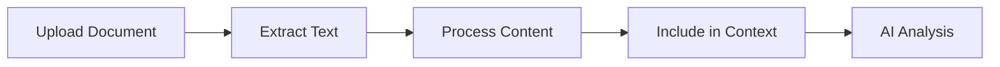

# 🤖 Qwen Chat Interface

<div align="center">

**Modern, feature-rich chat interface for Qwen AI with document processing and RAG capabilities**


*A powerful chat interface combining Qwen 2.5 with Ollama, featuring document processing, web search, and an elegant UI built with Next.js 15 and React 19*

[Quick Start](#-quick-start) • [Features](#-features) • [Documentation](#-usage) • [Examples](#-examples)

</div>

---

## 📋 Table of Contents

- [✨ Features](#-features)
- [📦 Installation](#-installation)
- [🚀 Quick Start](#-quick-start)
- [💻 Usage](#-usage)
- [📄 Document Processing](#-document-processing)
- [⚙️ Configuration](#️-configuration)
- [📱 Mobile Support](#-mobile-support)
- [🏗️ Project Structure](#️-project-structure)
- [🔧 Development](#-development)
- [🤝 Contributing](#-contributing)
- [📜 License](#-license)

---

## ✨ Features

### Core Capabilities

- 🤖 **Qwen 2.5 Integration** - Powered by Ollama with qwen2.5-coder:7b model
- 💬 **Real-time Streaming** - See AI responses as they're generated
- 📄 **Document Processing** - Upload and analyze PDFs, DOCX, TXT, and Markdown files
- 🔍 **Web Search** - Integrated DuckDuckGo search for current information
- 🌐 **Webpage Extraction** - Extract and analyze content from any URL
- 🧠 **RAG (Retrieval-Augmented Generation)** - Vector database for document search
- 💾 **Conversation Memory** - Persistent storage with ChromaDB

### User Experience

- 🎨 **Beautiful UI** - Modern design with ShadCN UI components and Tailwind CSS
- 📱 **Mobile Optimized** - Responsive design with mobile-specific features
- 🌓 **Dark Mode** - Automatic dark/light mode with system preference detection
- 📊 **Multiple Conversations** - Organize chats in projects with sidebar navigation
- ⚡ **Instant Actions** - Floating action button for quick new chats on mobile
- 🔄 **Auto-save** - All conversations automatically saved to localStorage

### Advanced Features

- 🖼️ **Multimodal Support** - Attach images and documents to messages
- 🎯 **Smart Model Selection** - Automatic model selection based on task type
- 🔊 **Text-to-Speech (TTS)** - Browser-based voice output using system voices (macOS Samantha, Windows Jenny)
- 📈 **Performance Optimized** - Hardware-accelerated embeddings with Apple Silicon support
- 🔧 **Customizable Settings** - Adjust temperature, tokens, and other model parameters
- 📖 **Markdown Rendering** - Rich text formatting with code highlighting

### What Makes It Different?

| Feature | Qwen Chat | Traditional Chatbots |
|---------|-----------|---------------------|
| Document Processing | ✅ PDF, DOCX, TXT, MD | ❌ Limited |
| Mobile UX | ✅ Floating buttons, optimized UI | ❌ Desktop only |
| RAG Integration | ✅ Built-in vector DB | ❌ None |
| Local AI | ✅ 100% offline capable | ❌ Cloud-dependent |
| Streaming | ✅ Real-time responses | ⚠️ Some |
| Projects | ✅ Organize conversations | ❌ Single thread |

---

## 📦 Installation

### Prerequisites

- **Node.js** 18+ or higher
- **Python** 3.10+ (for backend)
- **Ollama** with Qwen 2.5 model installed
- **npm** or **yarn** or **pnpm**

### Quick Install

#### 1. Clone the Repository

```bash
git clone https://github.com/mrmoe28/qwen-chat.git
cd qwen-chat
```

#### 2. Install Ollama & Qwen Model

```bash
# Install Ollama (macOS)
brew install ollama

# Pull Qwen model
ollama pull qwen2.5-coder:7b
ollama pull qwen2.5:7b

# Start Ollama server
ollama serve
```

#### 3. Install Frontend Dependencies

```bash
cd frontend
npm install
```

#### 4. Install Backend Dependencies

```bash
cd ../backend
pip install -r requirements.txt
```

---

## 🚀 Quick Start

Get started in less than 5 minutes:

### 1. Start the Backend

```bash
cd backend
python3 main.py
```

**Expected output:**
```
🚀 Starting Qwen Chat Backend (Ollama Edition)...
✅ Connected to Ollama at http://localhost:11434
📦 Available models: ['qwen2.5-coder:7b', 'qwen2.5:7b']
✅ Backend ready!
INFO:     Uvicorn running on http://0.0.0.0:8000
```

### 2. Start the Frontend

```bash
cd frontend
npm run dev
```

**Expected output:**
```
▲ Next.js 16.0.1
- Local:        http://localhost:3000
- Network:      http://0.0.0.0:3000
✓ Ready in 2.5s
```

### 3. Open Your Browser

Visit [http://localhost:3000](http://localhost:3000)

**That's it!** 🎉 You're ready to chat with Qwen.

---

## 💻 Usage

### Basic Chat

1. Click **"New conversation"** in the sidebar
2. Type your message in the input field
3. Press **Enter** or click **Send**
4. Watch the AI respond in real-time

### Document Upload & Analysis

#### Uploading Documents

```markdown
1. Click the 📎 paperclip icon
2. Select a PDF, DOCX, TXT, or MD file
3. Type your question about the document
4. Send the message
```

#### Supported Formats

- **PDF** (.pdf) - Extracted using pypdf
- **Word** (.docx) - Parsed with python-docx
- **Text** (.txt) - Direct reading
- **Markdown** (.md) - Converted to text

#### Example: Analyzing a PDF

```
Upload: electric_bill.pdf
Message: "What are the total charges on this bill?"

Qwen will:
✓ Extract all text from the PDF
✓ Analyze the charges
✓ Calculate totals
✓ Explain the breakdown
```

### Advanced Features

#### Web Search

```
Message: "What's the latest news about AI?"

Qwen automatically:
✓ Searches DuckDuckGo
✓ Fetches relevant pages
✓ Synthesizes information
✓ Provides sourced answers
```

#### Project Organization

1. Click **Menu** → **New Project**
2. Enter project name and description
3. Create conversations within projects
4. All conversations organized by project

#### Model Settings

Adjust AI behavior:

- **Temperature** (0-2): Creativity level
- **Max Tokens** (256-8192): Response length
- **Top P** (0-1): Sampling diversity
- **Frequency/Presence Penalty**: Repetition control

---

## 📄 Document Processing

### How It Works



### API Endpoint

```typescript
POST /api/process-document

// Request
FormData: {
  file: File (PDF, DOCX, TXT, MD)
}

// Response
{
  "success": true,
  "filename": "document.pdf",
  "text": "Extracted content...",
  "chunks": 5,
  "size": 12543
}
```

### Processing Pipeline

1. **Upload** - File sent to backend
2. **Extract** - Text extracted using appropriate parser
3. **Chunk** - Split into manageable pieces (1000 chars)
4. **Context** - Included in chat message
5. **Analyze** - AI processes the content

---

## ⚙️ Configuration

### Environment Variables

#### Backend Environment

Create a `.env` file in the backend directory:

```bash
# .env (backend)
OLLAMA_BASE_URL=http://localhost:11434
OLLAMA_MODEL=qwen2.5-coder:7b
DATABASE_PATH=./data/conversations.db
LOG_LEVEL=INFO
```

#### Frontend Environment

Create a `frontend/.env.local` file for environment-specific configuration:

**For Local Development:**
```bash
# frontend/.env.local
NEXT_PUBLIC_API_BASE=http://localhost:8000
NEXT_PUBLIC_BACKEND_URL=http://localhost:8000
```

**For Production / Remote Access (via Cloudflare Tunnel):**
```bash
# frontend/.env.local
NEXT_PUBLIC_API_BASE=https://api.mrqwen.us
NEXT_PUBLIC_BACKEND_URL=https://api.mrqwen.us
```

> **Note:** The `.env.local` file is gitignored and must be created manually for each environment.

### Frontend Configuration

Update `frontend/src/lib/qwen-api.ts`:

```typescript
// API Base URL
const API_BASE_URL = '/api';

// Default settings
export const DEFAULT_MODEL_SETTINGS: ModelSettings = {
  temperature: 0.7,
  maxTokens: 2048,
  topP: 0.9,
  frequencyPenalty: 0,
  presencePenalty: 0,
};
```

### Backend Configuration

Update `backend/main.py`:

```python
# Ollama configuration
OLLAMA_BASE_URL = "http://localhost:11434"
OLLAMA_MODEL = "qwen2.5-coder:7b"
```

---

## 📱 Mobile Support

### Mobile-Specific Features

#### Floating Action Button (FAB)

- **Location**: Bottom-right corner (mobile only)
- **Function**: Quick new conversation
- **Always accessible** - No scrolling needed

#### Responsive Design

- ✅ Touch-optimized UI
- ✅ Mobile-friendly input
- ✅ Hamburger menu navigation
- ✅ Swipe-friendly sidebar

#### Scroll Improvements

- Tap **Qwen2.5** title to scroll to top
- Natural scrolling in conversations
- Auto-scroll to latest message

### Mobile Access via Ngrok

```bash
# Install ngrok
brew install ngrok

# Tunnel local server
ngrok http 3000

# Access from mobile
https://your-subdomain.ngrok-free.app
```

---

## 🏗️ Project Structure

```
qwen-chat/
├── frontend/
│   ├── src/
│   │   ├── app/
│   │   │   ├── layout.tsx          # Root layout
│   │   │   ├── page.tsx            # Main page
│   │   │   ├── globals.css         # Global styles
│   │   │   └── api/
│   │   │       └── chat/
│   │   │           └── route.ts    # API proxy
│   │   ├── components/
│   │   │   ├── ui/                 # ShadCN components
│   │   │   ├── chat-interface.tsx  # Main chat UI
│   │   │   ├── settings-dialog.tsx # Settings panel
│   │   │   ├── artifact-preview.tsx # Code/artifact viewer
│   │   │   └── markdown-message.tsx # Message renderer
│   │   ├── lib/
│   │   │   ├── qwen-api.ts         # API client
│   │   │   ├── storage.ts          # localStorage
│   │   │   └── utils.ts            # Utilities
│   │   └── types/
│   │       └── chat.ts             # TypeScript types
│   ├── package.json
│   └── tsconfig.json
├── backend/
│   ├── main.py                     # FastAPI server
│   ├── requirements.txt            # Python deps
│   ├── services/
│   │   ├── memory_service.py       # ChromaDB integration
│   │   ├── document_processor.py   # PDF/DOCX processing
│   │   ├── web_search.py           # DuckDuckGo search
│   │   ├── optimized_embeddings.py # Vector embeddings
│   │   └── model_registry.py       # Model management
│   └── data/
│       └── conversations.db        # SQLite database
└── README.md
```

---

## 🔧 Development

### Run Development Server

```bash
# Frontend (with hot reload)
cd frontend
npm run dev

# Backend (with auto-restart)
cd backend
python3 main.py
```

### Build for Production

```bash
# Frontend
cd frontend
npm run build
npm start

# Backend
cd backend
python3 main.py
```

### Run Linter

```bash
# Frontend
cd frontend
npm run lint

# Fix issues automatically
npm run lint -- --fix
```

### Testing

```bash
# Frontend (when tests are added)
npm test

# Backend
pytest
```

---

## 🔧 Troubleshooting

### Common Issues

#### Error: "Ollama not responding"

**Cause:** Ollama server not running

**Solution:**
```bash
# Start Ollama
ollama serve

# Check if running
curl http://localhost:11434/api/tags
```

#### Error: "Module not found: pypdf"

**Cause:** Backend dependencies not installed

**Solution:**
```bash
cd backend
pip install -r requirements.txt
```

#### Error: "Port 3000 already in use"

**Cause:** Another process using port 3000

**Solution:**
```bash
# Find process
lsof -i :3000

# Kill process
kill -9 <PID>

# Or use different port
PORT=3001 npm run dev
```

#### Mobile: Can't scroll to top

**Solution:**
- Tap the **Qwen2.5** title in header
- Or use the **+** floating button (bottom-right)

### Need More Help?

- 📖 [Full Documentation](https://github.com/mrmoe28/qwen-chat/wiki)
- 💬 [Discussions](https://github.com/mrmoe28/qwen-chat/discussions)
- 🐛 [Report Bug](https://github.com/mrmoe28/qwen-chat/issues)

---

## 📚 Examples

### Example 1: Document Analysis

```markdown
1. Upload "contract.pdf"
2. Ask: "What are the key terms and obligations?"
3. Qwen extracts text and analyzes:
   ✓ Identifies parties
   ✓ Lists obligations
   ✓ Highlights important dates
   ✓ Summarizes terms
```

### Example 2: Code Assistance

```markdown
Message: "Write a Python function to calculate fibonacci numbers"

Response:
```python
def fibonacci(n: int) -> int:
    """Calculate the nth Fibonacci number."""
    if n <= 1:
        return n
    return fibonacci(n-1) + fibonacci(n-2)
```
```

### Example 3: Web Research

```markdown
Message: "What are the latest developments in quantum computing?"

Qwen will:
1. Search DuckDuckGo
2. Fetch relevant articles
3. Synthesize information
4. Provide sourced summary
```

---

## 🛠️ Technologies Used

### Frontend

- **[Next.js 16.0.1](https://nextjs.org/)** - React framework with App Router
- **[React 19.2.0](https://react.dev/)** - UI library with React Server Components
- **[TypeScript 5](https://www.typescriptlang.org/)** - Type safety
- **[Tailwind CSS 4](https://tailwindcss.com/)** - Utility-first styling
- **[ShadCN UI](https://ui.shadcn.com/)** - Component library
- **[Lucide React](https://lucide.dev/)** - Beautiful icons
- **[React Markdown](https://github.com/remarkjs/react-markdown)** - Markdown rendering

### Backend

- **[FastAPI](https://fastapi.tiangolo.com/)** - High-performance async Python framework
- **[Ollama](https://ollama.ai/)** - Local LLM server
- **[ChromaDB](https://www.trychroma.com/)** - Vector database for RAG
- **[pypdf](https://pypdf.readthedocs.io/)** - PDF text extraction
- **[python-docx](https://python-docx.readthedocs.io/)** - DOCX processing
- **[sentence-transformers](https://www.sbert.net/)** - Text embeddings
- **[MLX](https://github.com/ml-explore/mlx)** - Apple Silicon acceleration

---

## 🗺️ Roadmap

### Current Version (0.1.0)
- ✅ Core chat functionality
- ✅ Document processing (PDF, DOCX, TXT, MD)
- ✅ Mobile optimization
- ✅ RAG integration
- ✅ Project organization

### Next Release (0.2.0)
- ✅ Text-to-Speech (TTS) for AI responses
- 🔄 Voice input (STT)
- 🔄 Enhanced artifact viewer
- 🔄 Advanced search filters
- 📋 Export conversations
- 📋 Custom system prompts

### Future
- [ ] Multi-language support
- [ ] Collaborative features
- [ ] API key management UI
- [ ] Plugin system
- [ ] Desktop app (Electron)

---

## 🤝 Contributing

We love contributions! Here's how you can help:

### Quick Contribution Guide

1. **Fork** the repository
2. **Create** a feature branch (`git checkout -b feature/amazing`)
3. **Commit** changes (`git commit -m 'feat: Add amazing feature'`)
4. **Push** to branch (`git push origin feature/amazing`)
5. **Open** a Pull Request

### Development Setup

```bash
# Clone your fork
git clone https://github.com/your-username/qwen-chat.git

# Install dependencies
cd qwen-chat/frontend
npm install

cd ../backend
pip install -r requirements.txt

# Start development servers
./start-servers.sh
```

### Guidelines

- ✅ Write descriptive commit messages
- ✅ Follow existing code style
- ✅ Update documentation
- ✅ Test your changes
- ✅ Keep PRs focused and small

---

## 📜 License

This project is licensed under the **MIT License** - see [LICENSE](./LICENSE) file for details.

---

## 🌟 Acknowledgments

### Built With Love Using

- [Qwen 2.5](https://qwenlm.github.io/) - Powerful language model
- [Ollama](https://ollama.ai/) - Local LLM infrastructure
- [Vercel](https://vercel.com/) - Frontend hosting
- [Next.js](https://nextjs.org/) - React framework

### Inspiration

- [ChatGPT](https://chat.openai.com/) - Conversational AI interface
- [Claude](https://claude.ai/) - Advanced AI assistant
- [Open WebUI](https://github.com/open-webui/open-webui) - Self-hosted AI UI

---

<div align="center">

**Made with ❤️ and AI**


⭐ Star this repo if you find it useful!

[GitHub](https://github.com/mrmoe28/qwen-chat) • [Report Bug](https://github.com/mrmoe28/qwen-chat/issues) • [Request Feature](https://github.com/mrmoe28/qwen-chat/issues)

</div>
